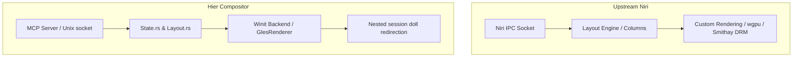

# Porting Guide: Upstream Niri to Hier Wayland Compositor

This guide documents the architectural differences, layout paradigms, animation physics, and communication layers between upstream **Niri** (the reference scrollable-tiling compositor) and **Hier** (our hierarchical nested Wayland compositor built on Smithay).

---

## 1. Architectural Overview

The core difference between upstream Niri and Hier lies in their rendering loops and window virtualization strategy.



### Key Structural Divergences

| Feature / System | Upstream Niri | Hier Compositor |
| :--- | :--- | :--- |
| **Window Shell** | XdgShell integration with direct output mapping | Multi-Doll Session Redirection (Recursive nesting) |
| **Rendering Backend** | Custom rendering pipeline (via `wgpu` or GLES) | `GlesRenderer` bound inside Winit context |
| **Control Interface** | Custom JSON IPC socket (`niri msg`) | Built-in Model Context Protocol (MCP) server & Owner-only socket |
| **Animation Engine** | Global spring animations per window | Specialized split springs (`camera`, `window`, `overview`) |
| **Performance Tracking**| System-level frame profiling | Rolling frame-time telemetry with live socket reporting |

---

## 2. Layout & Window Management

Both compositors organize windows in columns on infinite horizontal strips (workspaces). However, the implementation files and data models differ.

### Mapping Data Structures

* **Workspaces & Columns:**
  * **Niri:** Manages layout nodes inside a comprehensive window tree structure (`layout::Layout`).
  * **Hier:** Simplified inside [src/layout.rs](file:///home/super/Work/rust-based-dev/niri-rebuild/src/layout.rs) via `LayoutEngine`, which contains `workspaces: Vec<Workspace>`, where each `Workspace` holds a `columns: Vec<Column>` vector of `Window` structs.
* **Coordinate Mapping:**
  * **Niri:** Performs coordinates calculations relative to output boundaries with smooth window sliding.
  * **Hier:** Calculates window dimensions dynamically as percentage-based layout slots to prevent overflow, especially in virtual/VNC environments (e.g. `width * ratio / 100`).

---

## 3. Spring Physics & Animations

Hier replaces Niri's single generalized spring transition system with three specialized springs to tune distinct visual actions.

### Physics Parameters Comparison

```rust
// Hier Spring Physics implementation in src/spring.rs
pub struct Spring {
    pub stiffness: f32,
    pub damping: f32,
}
```

* **Camera / Panning Spring:**
  * **Hier Constants:** Stiffness `170.0`, Damping `26.0` (Critically damped).
  * **Env Var:** `HIER_CAMERA_STIFFNESS` / `HIER_CAMERA_DAMPING`
* **Window Sizing / Snapping Spring:**
  * **Hier Constants:** Stiffness `240.0`, Damping `30.0` (Fast, snappy snap).
  * **Env Var:** `HIER_WINDOW_STIFFNESS` / `HIER_WINDOW_DAMPING`
* **Workspace Overview Zooming Spring:**
  * **Hier Constants:** Stiffness `150.0`, Damping `24.0` (Smooth, cinematic zoom).
  * **Env Var:** `HIER_OVERVIEW_STIFFNESS` / `HIER_OVERVIEW_DAMPING`

### Live Tuning Porting
Hier exposes a live socket command `set_spring <camera|window|overview> <stiffness> <damping>` which updates parameters inside `LayoutEngine` on the fly. To port this to Niri, similar match arms must be added to Niri's IPC command parser.

---

## 4. Control Interfaces: IPC vs MCP

* **Niri IPC:** Runs a Unix socket (`niri.wayland-*.sock`) that accepts serialized JSON requests for layouts, actions, and output parameters.
* **Hier MCP:** Implements an automation layer via [mcp_hier_server.py](file:///home/super/Work/rust-based-dev/niri-rebuild/mcp_hier_server.py) translating JSON-RPC requests to an owner-restricted control socket (`/tmp/hier-ctrl-*.sock`).

### Command Translation Path

To execute equivalent control commands:

| Action | Niri IPC CLI command | Hier Control Socket command |
| :--- | :--- | :--- |
| Focus Left | `niri msg action focus-column-left` | `action focus-left` |
| Get Windows | `niri msg --json windows` | `get_layout_compact` |
| Capture Surface | `grim -g "<coords>" screenshot.png` | `capture_window <window_id> <path.ppm>` |
| Set Border Highlight | `niri msg action debug-border-color` | `highlight_window <window_id> <color>` |

---

## 5. Telemetry & Smoothness Profiling

Hier introduces low-overhead performance telemetry built directly into the compositor's event loop tick in [src/winit_backend.rs](file:///home/super/Work/rust-based-dev/niri-rebuild/src/winit_backend.rs).

### Telemetry Pipeline
1. **Tick Measurement:** Each iteration of the main loop calculates `dt` (elapsed time since last loop).
2. **Rolling Buffer:** Stores the last `200` frame times (in milliseconds) inside `State.frame_times`.
3. **Stutter Detection:** Increments `stutter_count` if `dt * 1000.0 > HIER_STUTTER_THRESHOLD_MS` (default `18.0` ms).
4. **Socket Reporting:**
   * `get_telemetry`: Returns JSON timing metrics:
     ```json
     {
       "min_ms": 11.2,
       "max_ms": 28.5,
       "mean_ms": 16.6,
       "stddev_ms": 1.4,
       "stutter_count": 0,
       "total_frames": 200,
       "frame_times": [...]
     }
     ```
   * `reset_telemetry`: Resets timing buffers before initiating test animations.

---

## 6. How to Port a Feature from Hier to Upstream Niri

### Case Study: Porting Telemetry Tracking to Niri
To port Hier's frame telemetry to Niri:
1. **Define Struct:** Add a `Telemetry` struct inside Niri's main state tracking arrays (e.g. `src/state.rs` or `src/rendering.rs`).
2. **Hook the Render Loop:** Locate Niri's main compositor draw block (which hooks into `smithay` or `wgpu` frame rendering events). Compute `dt` using `Instant::now()`.
3. **Record Metrics:** Push the rendering delta times into a rolling queue.
4. **Expose to IPC:** Add a `get-telemetry` sub-command to Niri's IPC protocol parsing code (typically found inside `src/ipc.rs` or `niri-ipc` crate), serializing the metric statistics to the socket client.
